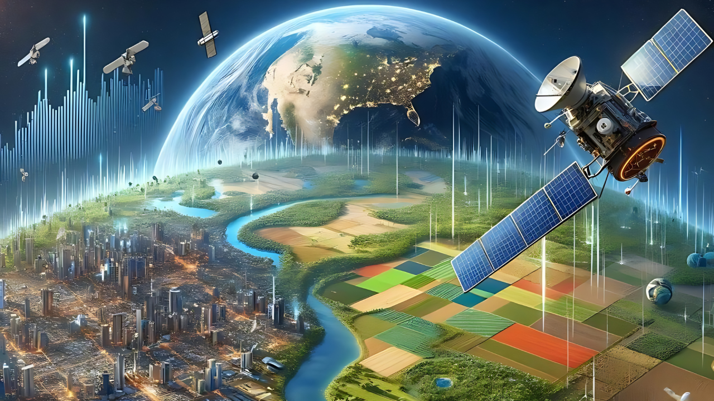

### Hi👋 I am Nguyen Anh Duc from VietNam :revolving_hearts:

- 🔭 I’m currently working as an AI Software Engineer.
- 🌱 I’m currently applying Machine Learning for Earth Observation, AI-Based Image Processing, High-Resolution Enhancement. 
- 👯 I’m looking to collaborate on Business, Education and Research partners.
- 📫 How to reach me: [anhduc@vgm.ai](anhduc@vgm.ai)
- 😄 Pronouns: He/His
- ⚡ Fun fact: Satman :technologist:

:seedling: :potted_plant: :deciduous_tree: :palm_tree: :leaves: :four_leaf_clover: :broccoli: :sunflower: :mushroom: :herb: :cactus: :palm_tree: :tulip: :cherry_blossom: :rose: :hibiscus: :bouquet: :melon: :cucumber: :watermelon: :lemon: :tomato: :strawberry: :cherries: :orange: :coconut:  :avocado: :peanuts: :potato: :corn: :honeybee:	:butterfly: :spider: :lady_beetle: :bug: :maple_leaf:
